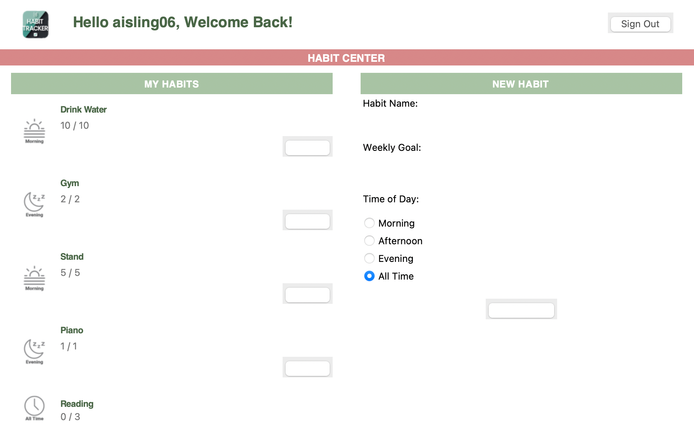

# Habit Tracker

What is this GitHub repository about?
This repository contains our final project for COMP 123: a Habit Tracker Application built with Python and Tkinter.
The app allows users to:
* Create an account and log in
* Add personalized habits with weekly goals
* Track daily/weekly progress
* View habits dynamically rendered in the UI
* Visualize habits with custom icons representing their timeframe
All user data is stored in a JSON mini-database, so progress is saved between sessions.

Software Requirements
To run this project, you will need:
* Python 3.10 or above
* Tkinter (comes pre-installed with most Python distributions)
* Pillow (PIL) for image support
pip install pillow
* PyCharm 2025.2.3 (or any IDE that supports Python)
Optional:
* Git / GitHub Desktop (for cloning the repository)

How to Run the Code
Follow these steps to set up the project:
1. Clone the repository
git clone <your-repo-link>
2. Open the folder in PyCharm
PyCharm will automatically detect the Python interpreter.
3. Install required packages
pip install pillow
4. Ensure file structure is correct
The project should contain:
project/
│── assets/         
│── data/            
│── screens/         
│── utils/           
│── main.py          
5. Run the application
Simply run:
python main.py
The habit tracker window will open automatically.

📌 Expected Output 
Below are screenshots of the main UI screens:

(Insert your Login screen screenshot)
(Insert Signup screen screenshot)
(Insert Habit Center screen with habits + icons)
These images show what a typical user experience looks like, including habit rendering, progress updating, and visual icons.